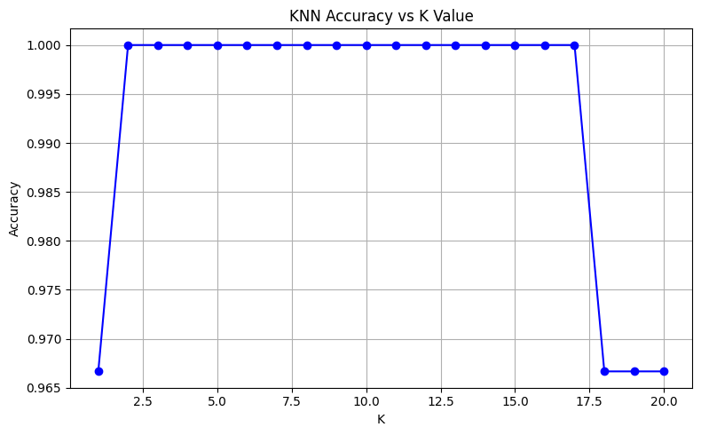
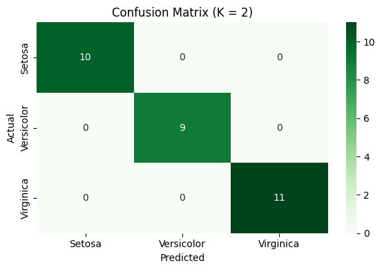

# Elevate Labs Internship
## 🧠 Task 6: K-Nearest Neighbors (KNN) Classification

### 📌 Objective
To understand and implement the K-Nearest Neighbors algorithm for solving classification problems using the Iris dataset.

### 🛠 Tools Used
- Python
- Pandas
- Matplotlib
- Seaborn
- Scikit-learn

---

### 📁 Dataset
- **Name:** Iris.csv
- **Features:**
  - SepalLengthCm
  - SepalWidthCm
  - PetalLengthCm
  - PetalWidthCm
- **Target:** Species (Setosa, Versicolor, Virginica)

---

## 🔍 Steps Performed

1. **Data Preprocessing**
   - Loaded and cleaned the dataset.
   - Encoded species labels.
   - Normalized the features using `StandardScaler`.

2. **Model Building**
   - Split the data into training and testing sets (80-20).
   - Trained `KNeighborsClassifier` for different values of K (1 to 20).
   - Selected the best K value based on accuracy.

3. **Evaluation**
   - Evaluated final model using accuracy score, confusion matrix, and classification report.
   - Visualized:
     - Accuracy vs K plot
     - Confusion matrix heatmap

---

## 🔢 Model Evaluation

### ✅ Best K Value:
**K = 2**

### 📈 Accuracy vs K Plot

### 📊 Classification Report:
               precision    recall  f1-score   support

           0       1.00      1.00      1.00        10
           1       1.00      1.00      1.00         9
           2       1.00      1.00      1.00        11

    accuracy                           1.00        30
    macro avg      1.00      1.00      1.00        30
    weighted avg   1.00      1.00      1.00        30

### 🧾 Confusion Matrix:

---

## 📚 Interview Questions & Answers

1. **How does the KNN algorithm work?**  
   It finds the K-nearest points in the training set to a test sample and predicts the majority class among them.

2. **How do you choose the right K?**  
   By using cross-validation or plotting accuracy against various K values and selecting the one with the highest validation accuracy.

3. **Why is normalization important in KNN?**  
   Because KNN is distance-based, and unscaled features can bias distance calculations.

4. **What is the time complexity of KNN?**  
   O(n × d) during prediction, where n is the number of training samples and d is feature dimensions.

5. **What are pros and cons of KNN?**  
   Pros: Simple, intuitive, no training phase.  
   Cons: Slow at prediction, sensitive to irrelevant features and noise.

6. **Is KNN sensitive to noise?**  
   Yes, especially when K is small.

7. **How does KNN handle multi-class problems?**  
   By using majority voting among K neighbors across all classes.

8. **What’s the role of distance metrics in KNN?**  
   Distance metrics like Euclidean, Manhattan, or Minkowski define how closeness is measured and directly impact prediction quality.

---

## 🏁 Conclusion

The KNN classifier performed perfectly on the normalized Iris dataset, achieving **100% accuracy** with **K = 2**. This demonstrates that for well-separated and clean datasets, KNN can be extremely effective.
